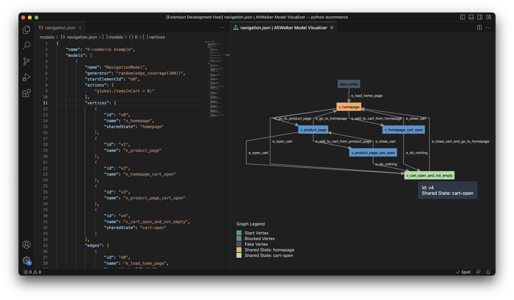

# AltWalker Model Visualizer - VS Code Extension

A Visual Studio Code extension for visualizing and editing JSON models. It expects the format required by [AltWalker](https://altwalker.github.io/altwalker/) and [GraphWalker](http://graphwalker.github.io/).

**What is AltWalker?**

[AltWalker](https://altwalker.github.io/altwalker/) is a Model-Based Testing framework that supports running tests written in python3 and .NET/C#.

**What is GraphWalker?**

[GraphWalker](http://graphwalker.github.io/) is a Model-Based testing tool. It reads models in the shape of directed graphs, and generates test paths from these graphs.



## Get started

To get started with AltWalker Model Visualizer - VS Code Extension:

1. Install Visual Studio Code 1.0.0 or higher
2. Launch Visual Studio Code
3. Open the command palette using `Ctrl`+ `Shift` + `P` (Windows & Linux) or `Cmd`+ `Shift`+ `P` (MacOS)
4. Select *"Install Extension"*
5. Type *"AltWalker Model Visualizer"* and choose the extension from the list.
7. Reload Visual Studio Code

## Features

### Preview Models

You can preview your AltWalker or GraphWalker models in the side panel by using the shortcut `Ctrl` + `Shift` + `V` (Windows & Linux) or `Cmd` + `Shift` + `V` (MacOS).


### Snippets

The extension provides several snippets that can be accessed by pressing `Ctrl` + `Space`.

The following table lists the available snippets and their descriptions:

| Snippet | Description |
| ------- | ----------- |
| actions | Creates an action template. An action is a piece of JavaScript code executed by GraphWalker. You can place action on the model level which will be executed before any step from that model or on an edge which will be executed when an edge is reached. |
| altwalker | Creates an AltWalker models file template. |
| dependency | Creates a dependency template. The `dependency` field is optional, it can be used to set dependencies and use them with `dependency_edge_coverage`. |
| edge | Creates an edge template. An edge is an action that takes the system under tests form one state (vertex) to another. |
| example | Creates an example model with three vertices. |
| generator | Creates a generator template. A generator is an algorithm that decides how to traverse a model. Different generators will generate different test sequences, and they will navigate in different ways. |
| guard | Creates a guard template. The `guard` field is optional, it can be used to set a guard on this edge. |
| model | Creates a model template. |
| properties | Creates a properties template. The `properties` field is optional, it can be used to store pairs of key/data. |
| requirements | Creates a requirements template. The `requirements` field is optional, it can be used to set tags on vertices and use them with `requirement_coverage`. |
| sharedState | Creates a shared state template. The `sharedState` field is optional, it can be used to link to vertices from different models. Any vertices with the same value for `sharedState` are linked. |
| vertex | Creates a vertex template. A vertex is a state of the system under tests. In the test code this is the place where the actual test (asserts) takes place. |
| weight | Creates a weight template. The `weight` field is optional, it can be used to set weights and use them with `weighted_random`. |

If you need help with modeling, please consult our [modeling guide](https://altwalker.github.io/altwalker/core/modeling.html).

### Settings Options

The extension provides various settings options that can be configured in the Visual Studio Code settings. Here are some examples:

* `altwalker.layout.align`: Specifies the alignment for rank nodes (e.g. Up-Left, Up-Right, Down-Left, **Down-Right**).

  ```json
  {
    "altwalker.layout.align": "Down-Right"
  }
  ```

* `altwalker.layout.edgesep`: Sets the number of pixels that separate edges horizontally in the layout (min: 1, max: 500, default: 10).

  ```json
  {
    "altwalker.layout.edgesep": 10
  }
  ```

* `altwalker.layout.legend`: Enables/disables the rendering of the legend (default: true).

  ```json
  {
    "altwalker.layout.legend": true
  }
  ```

* `altwalker.layout.marginx`: Defines the number of pixels used as a margin around the left and right of the graph (min: 1, max: 500, default: 1).

  ```json
  {
    "altwalker.layout.marginx": 1
  }
  ```

* `altwalker.layout.marginy`: Defines the number of pixels used as a margin around the top and bottom of the graph (min: 1, max: 500, default: 1).

  ```json
  {
    "altwalker.layout.marginy": 1
  }
  ```

* `altwalker.layout.nodesep`: Sets the number of pixels that separate nodes horizontally in the layout (min: 1, max: 500, default: 1).

  ```json
  {
    "altwalker.layout.nodesep": 1
  }
  ```

* `altwalker.layout.rankdir`: Specifies the direction for rank nodes (e.g. **Top-Bottom**, Bottom-Top, Left-Right, Right-Left).

  ```json
  {
    "altwalker.layout.rankdir": "Top-Bottom"
  }
  ```

* `altwalker.layout.ranker`: Determines the algorithm used to assign ranks to nodes in the input graph (e.g Longest Path, Tight Tree, **Network Simplex**).

  ```json
  {
    "altwalker.layout.ranker": "Network Simplex"
  }
  ```

* `altwalker.layout.ranksep`: Sets the number of pixels between each rank in the layout (min: 1, max: 500, default: 50).

  ```json
  {
    "altwalker.layout.ranksep": 50
  }
  ```

## Models Format

For more information you can visit [AltWalker documentation](https://altwalker.github.io/altwalker/core/modeling.html) or [Graphwalker documentation](https://graphwalker.github.io/).

An example of json model can be found [here](model.json).

## Support

If you need help with modeling, please consult our [modeling guide](https://altwalker.github.io/altwalker/core/modeling.html).

Alternatively, you can use our [Model-Editor](https://altwalker.github.io/model-editor) tool to build models visually without writing code.

Join our Gitter chat room [here](https://gitter.im/altwalker/community) to chat with us or with other members of the community.

## Development Setup

## Dependencies

* [D3](https://d3js.org/)
* [d3-legend](https://d3-legend.susielu.com/)
* [dagre-d3](https://github.com/dagrejs/dagre-d3)
* [Model-Visualizer](https://altwalker.github.io/model-visualizer/)
* [Vue.js](https://vuejs.org/)

## License

This project is licensed under the [GNU General Public License v3.0](LICENSE).
