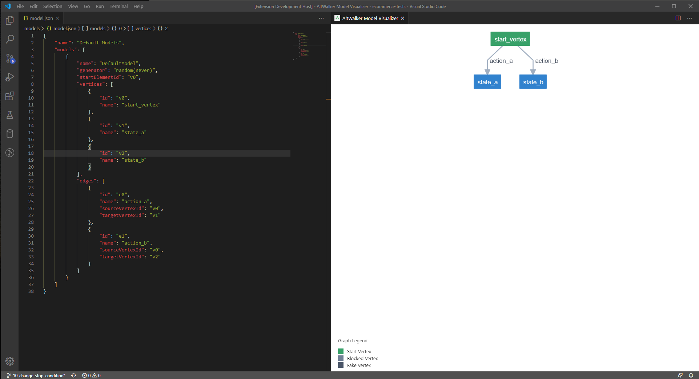
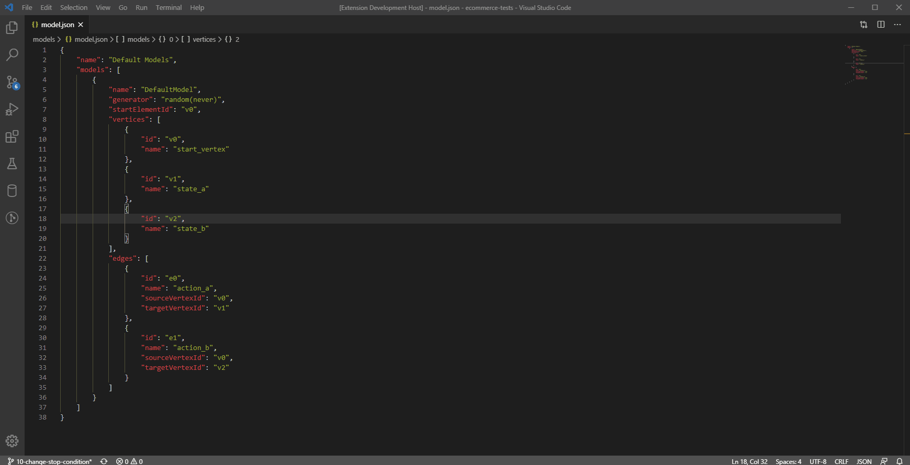

# AltWalker Model Visualizer

A Visual Studio Code extension for visualizing and editing JSON models. It expects the format required by [AltWalker](https://altom.gitlab.io/altwalker/altwalker/) and [GraphWalker](http://graphwalker.github.io/).

[AltWalker](https://altom.gitlab.io/altwalker/altwalker/) is a Model-Based Testing framework that supports running tests written in python3 and .NET/C#.

[GraphWalker](http://graphwalker.github.io/) is a Model-Based testing tool. It reads models in the shape of directed graphs, and generates test paths from these graphs.



## Get started

1. Install Visual Studio Code 1.0.0 or higher
2. Launch Code
3. From the command palette `Ctrl+Shift+P` (Windows & Linux) or `Cmd+Shift+P` (MacOS)
4. Select Install Extension
5. Type `AltWalker Model Visualizer`
6. Choose the extension
7. Reload Visual Studio Code

## Features

* `Preview on side panel (Windows & Linux: ctrl+shift+v, MacOS: cmd+shift+v)`: Easily check your [AltWalker](https://altom.gitlab.io/altwalker/altwalker/) or [GraphWalker](http://graphwalker.github.io/) models.



## Models Format

An example of json model can be found [here](model.json).

For more informations you can visit [AltWalker documentation](https://altom.gitlab.io/altwalker/altwalker/) or [Graphwalker documentation](https://graphwalker.github.io/).

## Snippets

Press `Ctrl` +`Space` for snippets suggestions.

| Snippet | Description |
| ------- | ----------- |
| actions | Creates an action template. An action is a piece of JavaScript code executed by GraphWalker. You can place action on the model level which will be executed before any step from that model or on an edge which will be executed when an edge is reached. |
| altwalker | Creates an AltWalker models file template |
| dependency | Creates a dependency template. Dependency field is optional, it can be used to set dependencies and use them with dependency_edge_coverage. |
| edge | Creates an edge template. An edge is an action that takes the system under tests form one state (vertex) to another. |
| example | Creates an example model with three vertices. |
| generator | Creates a generator template. A generator is an algorithm that decides how to traverse a model. Different generators will generate different test sequences, and they will navigate in different ways. |
| guard | Creates a guard template. Guard field is optional, it can be used to set a guard on this edge. |
| model | Creates a model template. |
| properties | Creates a properties template. Properties field is optional, it can be used to store pairs of key/data. |
| requirements | Creates a requirements template. Requirements field is optional, it can be used to set tags on vertices and use them with requirement_coverage. |
| sharedState | Creates a sharedState template. SharedState field is optional, it can be used to link to vertices from different models. Any vertices with the same value for sharedState are linked. |
| vertex | Creates a vertex template. A vertex is a state of the system under tests. In the test code this is the place where the actual test (asserts) takes place. |
| weight | Creates a weight template. Weight field is optional, it can be used to set weights and use them with weighted_random. |

## Settings Options

* `altwalker.layout.align`: Alignment for rank nodes. Can be Up-Left, Up-Right, Down-Left, or Down-Right (default: Down-Right).
  ```json
    {
      "altwalker.layout.align": "Down-Right"
    }
  ```
* `altwalker.layout.edgesep`: Number of pixels that separate edges horizontally in the layout (min: 1, max: 500, default: 10).
  ```json
    {
      "altwalker.layout.edgesep": 10
    }
  ```
* `altwalker.layout.legend`: True/False to render the legend (default: true).
  ```json
    {
      "altwalker.layout.legend": true
    }
  ```
* `altwalker.layout.marginx`: Number of pixels to use as a margin around the left and right of the graph (min: 1, max: 500, default: 1).
  ```json
    {
      "altwalker.layout.marginx": 1
    }
  ```
* `altwalker.layout.marginy`: Number of pixels to use as a margin around the top and bottom of the graph (min: 1, max: 500, default: 1).
  ```json
    {
      "altwalker.layout.marginy": 1
    }
  ```
* `altwalker.layout.nodesep`: Number of pixels that separate nodes horizontally in the layout (min: 1, max: 500, default: 1).
  ```json
    {
      "altwalker.layout.nodesep": 1
    }
  ```
* `altwalker.layout.rankdir`: Direction for rank nodes. Can be Top-Bottom, Bottom-Top, Left-Right, Right-Left (default: "Top-Bottom").
  ```json
    {
      "altwalker.layout.rankdir": "Top-Bottom"
    }
  ```
* `altwalker.layout.ranker`: Type of algorithm to assigns a rank to each node in the input graph. Can be Longest Path, Tight Tree, Network Simplex (default: Network Simplex).
  ```json
    {
      "altwalker.layout.ranker": "Network Simplex"
    }
  ```
* `altwalker.layout.ranksep`: Number of pixels between each rank in the layout (min: 1, max: 500, default: 50).
  ```json
    {
      "altwalker.layout.ranksep": 50
    }
  ```

## Support

For help with modeling you can read our guide [here](https://altom.gitlab.io/altwalker/altwalker/modeling.html).

Join our Gitter chat room [here](https://gitter.im/altwalker/community) to chat with us or with other members of the community.

## The extension uses the following libraries

* [D3](https://d3js.org/)
* [d3-legend](https://d3-legend.susielu.com/)
* [dagre-d3](https://github.com/dagrejs/dagre-d3)
* [Model-Visualizer](https://altom.gitlab.io/altwalker/model-visualizer/index.html)
* [Vue.js](https://vuejs.org/)

## License

AltWalker Model Visualizer is licensed under the [GNU](LICENSE) General Public License v3.0.
